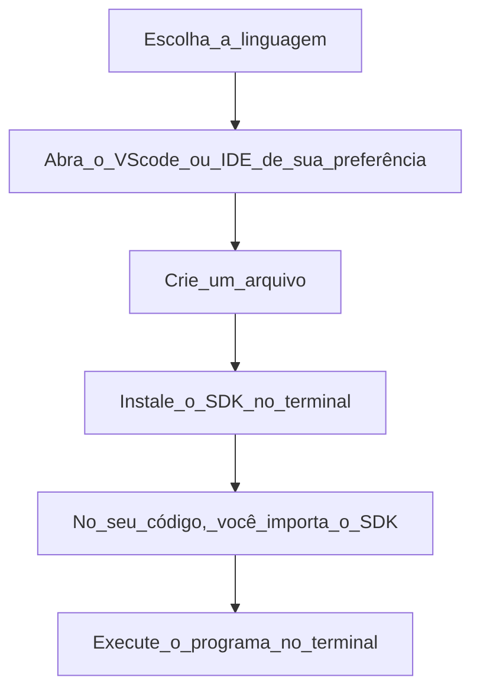

## **Insights no Language Studio**

Objetivo: Desenvolver habilidades práticas na criação de soluções baseadas em inteligência artificial voltadas para voz e linguagem

Acessar: https://speech.microsoft.com/portal

É possível criar projeto no code e fazer referência a esses ativos nos seus aplicativos usando o SDK de Fala, a CLI de Fala ou as APIs REST

**Glossário** 
1. SDK de fala: Software kit development fornece ferramentas, bibliotecas e APIs para que programadores consigam criar aplicações que reconhecem, sintetizam ou processam fala. Ou seja, ferramentas que fazem com que o programa entenda ou produza a fala. Dependendo da SDK pode haver: Reconhecimento de fala (ASR – Automatic Speech Recognition) → transformar fala em texto; Síntese de fala (TTS – Text-to-Speech) → transformar texto em áudio com voz artificial; Tradução de fala em tempo real → falar em um idioma e receber áudio ou texto em outro; Comandos por voz → interpretar palavras-chave para controlar aplicativos; Modelos personalizáveis → treinar com vocabulário específico da sua aplicação (por exemplo, termos médicos ou técnicos).
2. CLI de fala: A CLI de Fala é uma ferramenta de linha de comando para uso do serviço de Fala sem necessidade de codificação e exige configuração mínima.
3. APIs REST: trata-se de um tipo de API (Interface de Programação de Aplicações) que segue os princípios da arquitetura REST. É baseada em recursos, os métodos HTTP são bem definidos, o formatos de dados são leves, o servidor não guarda informações da sessão entre requisições e as URLs e respostas seguem um padrão, facilitando a integração.


OBS: Se você não quiser usar o SDK, também pode optar pelas APIs REST — úteis em casos específicos como transcrição em lote ou voz personalizada.


##Análise de texto

Para análise de texto, vamos utilizar o Language studio. 

**Quais são os recursos de Processamento de Linguagem Natural (PNL) no Azure?**


Estúdio de fala, Estúdio de linguagem, Tradutor personalizado, Estúdio de Visão, Document Inteligence e Segurança de Conteúdo.

**Explorando Estúdio de Fala**

O Estúdio de Fala realiza a conversão de texto em fala e fala em texto. Dentre os recursos de fala por situação temos:
1. Legendar com conversa de falar em texto;
2. Transcrição e análise de call center com o Fala e Idioma do Azure;
3. Avatar de chat ao vivo;
4. Aprendizagem de línguas;
5. Traduçã ode vídeo.

A conversão de fala em texto pode ser realizada através:
1. Conversão de fala em texto em tempo real;
2. Modelo do Whisper no Serviço OpenAI do Azure;
3. Conversão de Fala em Texto em Lote;
4. Fala Personalizada;
5. Avaliação de Pronúncia com conversa de fala em texto;
6. Tradução de fala.

A conversão de texto em falar pode ser realizada através:
1. Galeria de Serviço de Voz;
2. Ajuste fino de voz profissional;
3. Voz pessoal;
4. Criação de conteúdo de áudio;
5. Avatar de conversão de texto em fala.

Assistente de voz:
1. Palavra-chave personalizada.


Para que a empresa possa usufruir de tais recursos personalizados do Azure, é interessante seguir o fluxo:



> [!IMPORTANT]
**Linguagens suportadas pela SDK**

|Linguagem de programação|Referência|Suporte a plataforma|
|------------------------|----------|--------------------|
|C#|.NET|Windows, Linux, macOS, Mono, Xamarin.IOS, Xamarin.Mac, Xamarin.Android, UWP, Unity|
|C++|C++|Windows, Linux, macOS|
|Go|Go|Linux|
|Java|Java|Android, Window, Linux, macOS|
|JavaScript|JavaScript|Browser,Node.js|
|Objetice-C|Objectice-C|iOS, macOS|
|Python|Python|Windows, Linux, macOs|
|Swift|Objective-C|iOS, macOS|

**Exemplo de código com python**
```python
import azure.cognitiveservices.speech as speechsdk

speech_key = "SUA_CHAVE"
service_region = "SUA_REGIAO"

speech_config = speechsdk.SpeechConfig(subscription=speech_key, region=service_region)
synthesizer = speechsdk.SpeechSynthesizer(speech_config=speech_config)

text = "Olá Luana, esse é um teste de conversão de texto em voz no Windows."
synthesizer.speak_text_async(text).get()

```

>[!NOTE]
>A linha 6 é o ponto que conecta seu código na sua máquina ao recurso que você criou no Azure.


##Referências##
https://learn.microsoft.com/pt-br/azure/ai-services/language-service

Estúdio de Fala: https://learn.microsoft.com/pt-br/azure/ai-services/speech-service/overview

Legendagem com conversão de fala em texto: https://learn.microsoft.com/pt-br/azure/ai-services/speech-service/captioning-concepts
