## 📊 **A análise de sentimento**

A análise de sentimento é uma das aplicações mais conhecidas de Machine Learning dentro do Processamento de Linguagem Natural.
Trata-se do processo de identificar automaticamente a opinião ou emoção expressa em um texto e classificá-lo como:
- Positivo (elogios);
- Negativo (críticas, reclamações);
- Neutro (sem polaridade emocional clara)

🧠 O Machine Learning aprende a reconhecer sentimentos a partir de dados rotulados.

A mineração de opinião é um recurso da análise de sentimento, também conhecida como análise de sentimento baseada em aspecto no NLP (Processamento de Linguagem Natural). Esse recurso fornece informações mais granulares sobre as opiniões relacionadas a palavras (como os atributos de produtos ou serviços) no texto.

## **Fluxograma**

```mermaid
graph TD;
    A[Crie um recurso] --> B[Gere uma senha e uma URL de ponto extremidade];
    B --> C[Crie uma solicitação com API REST ou biblioteca de cliente para C#, Java, JS, Python];
    C --> D[Envie a solicitação com dados de texto];
    D --> E[A chave e o ponto de extremidade são usados para autenticação];
    E --> F[Transmita por streaming ou armazene a resposta localmente];
```

Há duas maneiras de usar a análise de sentimento:

|Ferramenta|Referência|
|----------|----------|
|Fábrica de IA dp Azure||    |
|API REST ou biblioteca de clientes (SDK do Azure)||
|Contêiner do Docker||     

