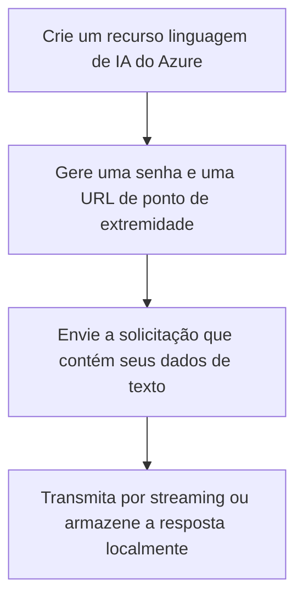

##  🔍 **Detecção de Idiomas**

A detecção de idioma é capaz de detectar mais de 100 idiomas em seu script primário. 

Detecção de idioma: para cada documento, retorna o idioma principal, seu código ISO 639-1, nome legível, pontuação de confiança, nome do script e código de script ISO 15924 

Detecção de script: para distinguir entre vários scripts usados para escrever determinados idiomas, como o cazaque, a detecção de idioma retorna um nome de script e um código de script de acordo com o padrão ISO 15924.  

Tratamento de conteúdo ambíguo: para ajudar a desambiguar o idioma com base na entrada, você pode especificar um código de país/região ISO 3166-1 alfa-2. Por exemplo, a palavra "communication" é comum ao inglês e ao francês. Especificar a origem do texto como França pode ajudar o modelo de detecção de idioma a determinar o idioma correto. 

🧠 No geral, existem duas abordagens principais:

**Baseada em regras/estatística**

1. Analisa características linguísticas, como frequência de palavras, combinações de caracteres (n-grams) e alfabetos usados.

   Exemplo: se o texto contém "ñ" e várias palavras terminadas em "ción", provavelmente é espanhol.

   Vantagem: rápida e eficiente.

   Limitação: pode falhar em textos curtos ou misturados (ex.: “Hola, thanks”).

2. Baseada em aprendizado de máquina/IA

   Modelos de machine learning ou deep learning treinados com grandes corpora multilíngues.

   Usam representações vetoriais de palavras (embeddings) e analisam contexto para prever o idioma.

  Exemplo: modelos baseados em Transformers (BERT, XLM-R, mBERT).

  Muito mais robusta para textos curtos, gírias e contextos mistos.

🧩 Fluxograma

 

 

 

Há três maneiras de usar a detecção de idioma: 

|Ferramenta|Referência|
|----------|----------|
|Fábrica de IA dp Azure||    |
|API REST ou biblioteca de clientes (SDK do Azure)||
|Contêiner do Docker||     
