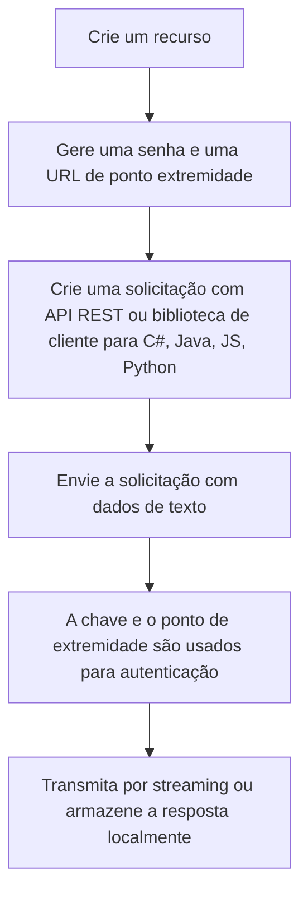

## **Extração de palavras-chave**

É o processo de identificar automaticamente os termos mais relevantes de um texto.
Essas palavras (ou expressões) representam os principais tópicos ou conceitos do conteúdo.

Como funciona esse processo? Existem as fases de pré-processamento e de identificação de relevância:

1. Pré-processamento

- Limpeza (remoção de stopwords como “de”, “em”, “o”).

- Tokenização (separar palavras).

- Lematização/stemming (reduzir palavras à sua raiz).

2. Identificação da relevância

- TF-IDF (Term Frequency – Inverse Document Frequency): mede a importância de uma palavra em um documento em relação a todo o corpus.

- RAKE (Rapid Automatic Keyword Extraction): encontra combinações de palavras significativas sem precisar de treino.

- Algoritmos baseados em grafos (ex.: TextRank): analisam relações entre palavras para extrair termos-chave.

- Modelos de linguagem (BERT, GPT): detectam palavras-chave de forma contextualizada.

Para usar a extração de frases-chave, você envia um texto bruto não estruturado para análise e manipula a saída da API no seu aplicativo. A análise é realizada no estado em que se encontra, sem personalização adicional no modelo usado nos seus dados. Há duas maneiras de usar a extração de frases-chave:

|Ferramenta|Referência|
|----------|----------|
|Fábrica de IA dp Azure||    |
|API REST ou biblioteca de clientes (SDK do Azure)||
|Contêiner do Docker||     

## **Fluxograma**

