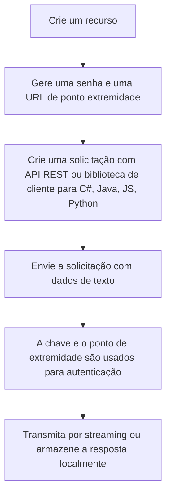

## **Reconhecimento de Entidade Nomeada (NER)**

Refere-se a algoritmos de aprendizado de máquina e IA na nuvem são utilizados para desenvolver aplicativos que envolvem linguagem escrita. Esse recurso pode identificar e categorizar entidades em texto não-estruturado.

## **Fluxograma:**

## **Sobre vinculação de entidade – Como a análise é realizada quando o texto é não estruturado?**

Para usar a vinculação de entidade, envie um texto não estruturado bruto para análise e identifique a saída da API em seu aplicativo. A análise é realizada no estado em que se encontra, sem nenhuma personalização adicional para o modelo usado em seus dados. Há duas maneiras de usar a vinculação de entidade: 

Tabela:

|Ferramenta|Referência|
|----------|----------|
|Language Studio||    |
|API REST ou biblioteca de clientes (SDK do Azure)||

## **Criar recurso de linguagem**

Para criar um recurso de linguagem, você deve entrar no portal Azure e se conectar a sua assinatua. Crie então, o recurso e a linguagem. Você deve verificar se a caixa de seleção Aviso de IA responsável está marcada para seguir em frente. Após esses passos, você precisará da chave e do ponto de extremidade do recurso para conectar seu aplicativo à API.
Em seguida, seu aplicativo deve ser autenticado para enviar solicitações de API e você eve criar variáveis de ambiente, usando o console usando a sua chave e o ponto de extremidade.

Referências:

