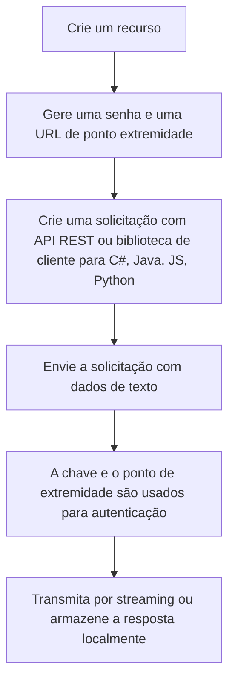

## **Sumarização**

A sumarização busca a descrição simples e compacta para um conjuntos de dados, ajudando a transformar grandes volumes de informação em algo mais fácil de ler e interpretar.

Temos:

1. Sumarização extrativa: em que partes do texto são selecionadas, sendo estas consideradas as mais importantes. São frases extraída do conteúdo de texto de entrada. A pontuação de classificação indica o quão relevante uma frase é para o tópico principal.
2. Sumarização abstrativa: em que são geradas novas frases, reescrevendo o conteúdo com palavras diferentes, ou seja, uma entrada longa pode ser segmentada para que vários grupos de textos de resumo possam ser retornados com seu intervalo de entrada contextual.
Intervalo de entrada contextual: o intervalo dentro da entrada que foi usado para gerar o texto de resumo.

Na Azure, trata-se de um recurso que combina modelos de Linguagem Grande generativos e modelos de codificador otimizados para tarefas que oferecem soluções de resumo com maior qualidade, ediciência de custo e latência mais baixa.

## **Fluxograma**

